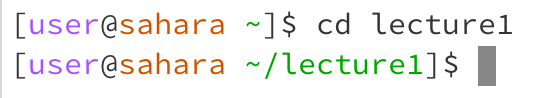
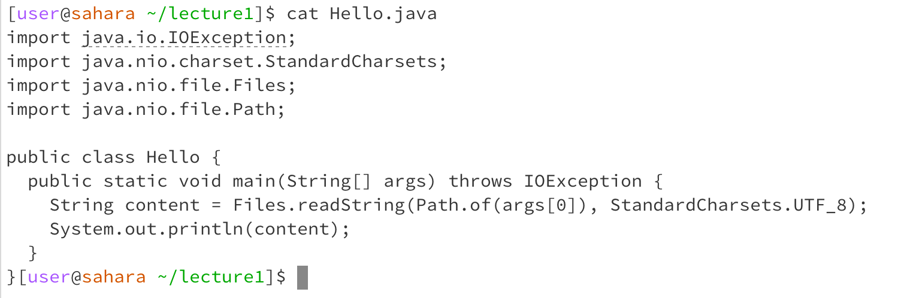

# Lab Report 1

      
* working directory: /home/lecture1
* because there was no argument, the working directory was set to home. no output.
* no error

   
* working directory: /home
* the argument lecture1 caused the directory to be changed to /home/lecture1. no output.
* no error

   
* working directory: /home/lecture1
* the argument was a file, not a directory as it was expecting. this caused an error message to print.
* the output is an error stating the file passed as an argument is not a directory, and cannot be set to the working directory.
  
   
* working directory: /home/lecture1
* having no argument made this print out the names of every file/directory in the working directory, which was /home/lecture1
* no error
  

* working directory: /home/lecture1
* with the argument 'messages', a directory, ls printed out the names of each of the files inside messages, which in this case are 4 txt files
* no error

   
* working directory: /home/lecture1
* with a file argument passed to ls, just the name of the file is printed
* no error
  

* working directory: /home/lecture1
* with no argument passed to cat, nothing appears to happen at first but it will duplicate any input given to the command line. 
* this is not an error because there was no error message
  

* working directory: /home/lecture1
* cat is used to print the contents of a file, so it won't work on a directory because 
* I believe this is an error, because cat should be used on a file
  

* working directory: /home/lecture1
* with the argument Hello.java, cat printed the content of that file
* not an error
