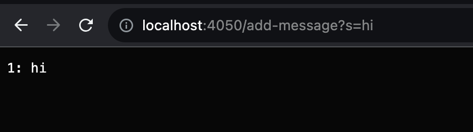
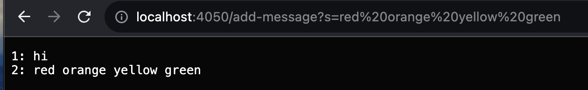

# **Lab Report 2**
---

## Part 1

StringServer.java:

      import java.io.IOException;
      import java.net.URI;

      class Handler implements URLHandler {

          String[] list = new String[100];
          int index = 0;

          public String displayList(String[] l){
              String output = "";
              int count = 1;
              for (String s : l){
                  if (s != null)
                      output += count + ": "+ s + "\n";
                      count++;
              }
              return output;
          }

          public String handleRequest(URI url) {
              if (url.getPath().equals("/")) {
                  return String.format(displayList(list));
              } 
              if (url.getPath().contains("/add-message")) {
                  String[] parameters = url.getQuery().split("=");
                  if (parameters[0].equals("s")) {
                       list[index] = parameters[1];
                       index++;
                       return String.format(displayList(list));
                }
              }
              return "404 Not Found!";
          }
      }

      class StringServer {
          public static void main(String[] args) throws IOException {
              if(args.length == 0){
                  System.out.println("Missing port number! Try any number between 1024 to 49151");
                  return;
              }

              int port = Integer.parseInt(args[0]);

              Server.start(port, new Handler());
          }
      }

* the method being called here is handleRequest, which calls getPath and getQuery, and finally displayList.
* the argument passed to handleRequest is the URI in the screenshot. The URI is parsed with the methods getPath, which returns the path component of the URL, and getQuery, which returns the query component. displayList is called, which prints the current list of messages, stored as a global array.
* from this request, the String "hi" is added to the first index of the array, and the index tracker is incremented.

* this request calls the same methods as the first one.
* this time, the updated URI seen in the screenshot is passed to handleRequest, which completes the same functions as the first time.
* the String seen in the screenshot is added to the global array at its second index, and the index tracker is incremented.

## Part 2

