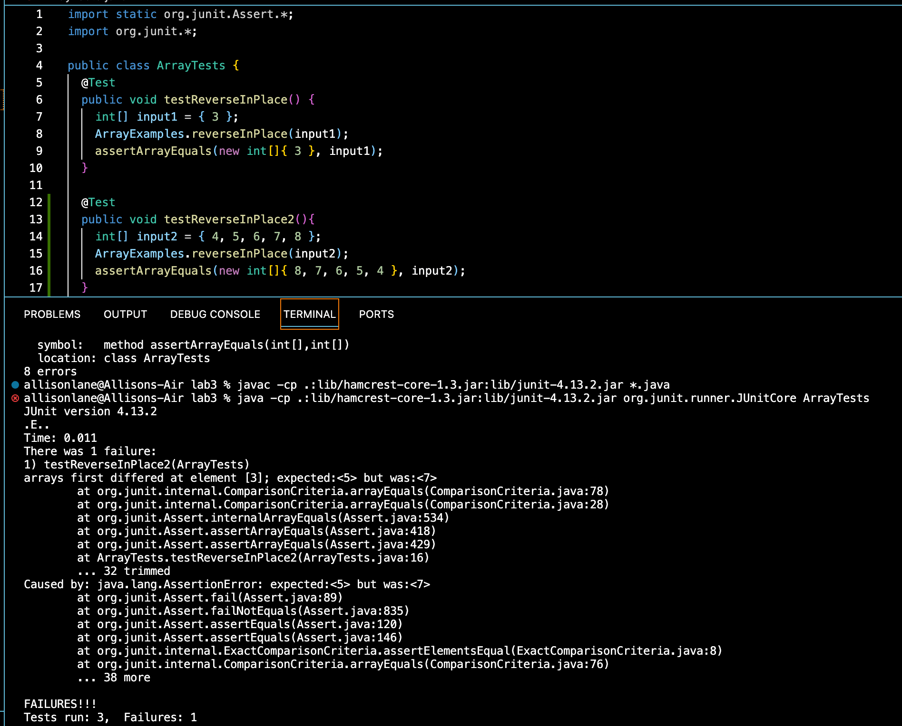

# **Lab Report 3**
---
## Part 1 - Bugs

Failure-inducing input:
```
@Test
  public void testReverseInPlace2(){
    int[] input2 = { 4, 5, 6, 7, 8 };
    ArrayExamples.reverseInPlace(input2);
    assertArrayEquals(new int[]{ 8, 7, 6, 5, 4 }, input2);
  }
```

Non-failure-inducing input:
```
@Test
  public void testReverseInPlace() {
    int[] input1 = { 3 };
    ArrayExamples.reverseInPlace(input1);
    assertArrayEquals(new int[]{ 3 }, input1);
}
```

Symptom:




The Bug- Before:
```
static void reverseInPlace(int[] arr) {
    for(int i = 0; i < arr.length; i += 1) {
      arr[i] = arr[arr.length - i - 1];
    }
  }
```

After:
```
 static void reverseInPlace(int[] arr) {
    for(int i = 0; i < arr.length / 2; i += 1) {
      int temp = arr[i];
      arr[i] = arr[arr.length - i - 1];
      arr[arr.length - i - 1] = temp;
    }
  }
```

The new code has a temp variable to store one of the elements being reversed so that its not overwritten before being swapped.


## Part 2 -  Researching Commands


*grep -c*
```
allisonlane@Allisons-Air docsearch % grep -c "terrorist" technical/911report/chapter-1.txt 
10
```
grep -c counts and displays the number of times a certain string appears in the given text file. This is useful because we can use wc, but that will count every word in a file and we may just want to know how many times one specific word is there.
(Source: the manual)

```
allisonlane@Allisons-Air docsearch % grep -c "terrorist" technical/911report/*.txt
technical/911report/chapter-1.txt:10
technical/911report/chapter-10.txt:24
technical/911report/chapter-11.txt:31
technical/911report/chapter-12.txt:101
technical/911report/chapter-13.1.txt:14
technical/911report/chapter-13.2.txt:6
technical/911report/chapter-13.3.txt:15
technical/911report/chapter-13.4.txt:28
technical/911report/chapter-13.5.txt:24
technical/911report/chapter-2.txt:19
technical/911report/chapter-3.txt:127
technical/911report/chapter-5.txt:29
technical/911report/chapter-6.txt:53
technical/911report/chapter-7.txt:9
technical/911report/chapter-8.txt:47
technical/911report/chapter-9.txt:11
technical/911report/preface.txt:3
```
Using grep -c on a group of text files prints the count of the number of occurences of the string in each respective file. This is useful instead of searching in each file one by one.
(Source: manual)

*grep -i*
```
allisonlane@Allisons-Air docsearch % grep -i "many" technical/government/Alcohol_Problems/Session2-PDF.txt
Many patients in the emergency department (ED) have alcohol
too many false positives. A test that is used to screen a
other drug use, depression, and anxiety disorders. Many of the
screening tests were developed outside the ED. Fortunately, many
Many injured ED patients are screened with a BAC, which can help
direct testing. Many tests would be improved by wording questions
even higher risk subgroups. Many experts advocate focusing
```
grep -i makes the search case-insensitive. This is useful when you want to search for a keyword but don't know if it will be at the beginning of sentences, or in some other casing convention. 
(Source: [](https://developer.mozilla.org/en-US/blog/searching-code-with-grep/))

```
allisonlane@Allisons-Air docsearch % grep -ci "the" technical/911report/*.txt
technical/911report/chapter-1.txt:323
technical/911report/chapter-10.txt:361
technical/911report/chapter-11.txt:567
technical/911report/chapter-12.txt:893
technical/911report/chapter-13.1.txt:704
technical/911report/chapter-13.2.txt:501
technical/911report/chapter-13.3.txt:699
technical/911report/chapter-13.4.txt:1140
technical/911report/chapter-13.5.txt:1526
technical/911report/chapter-2.txt:566
technical/911report/chapter-3.txt:1989
technical/911report/chapter-5.txt:670
technical/911report/chapter-6.txt:1122
technical/911report/chapter-7.txt:907
technical/911report/chapter-8.txt:669
technical/911report/chapter-9.txt:1264
technical/911report/preface.txt:71
```

The same search as in the grep -c example, this time making it case-insensitive as well. This alters the results by including instances of "the" with different cases, which is useful if you need a count of all instances of a string. 
(Source: manual & [](https://developer.mozilla.org/en-US/blog/searching-code-with-grep/))


