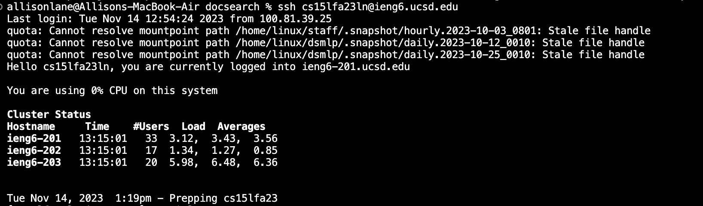
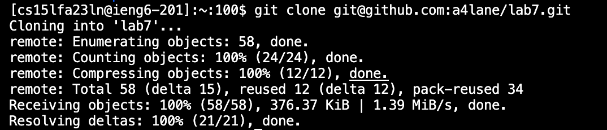
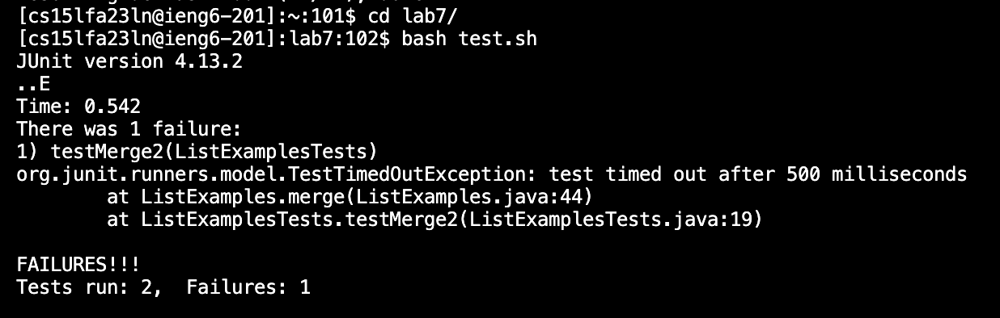
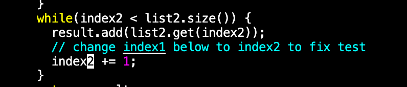
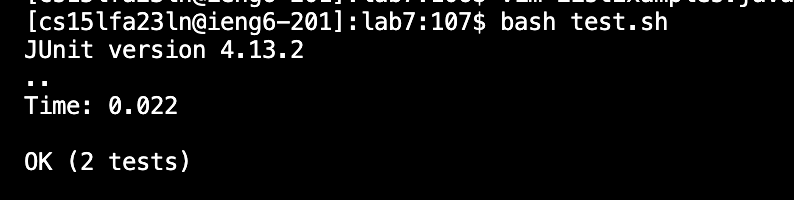
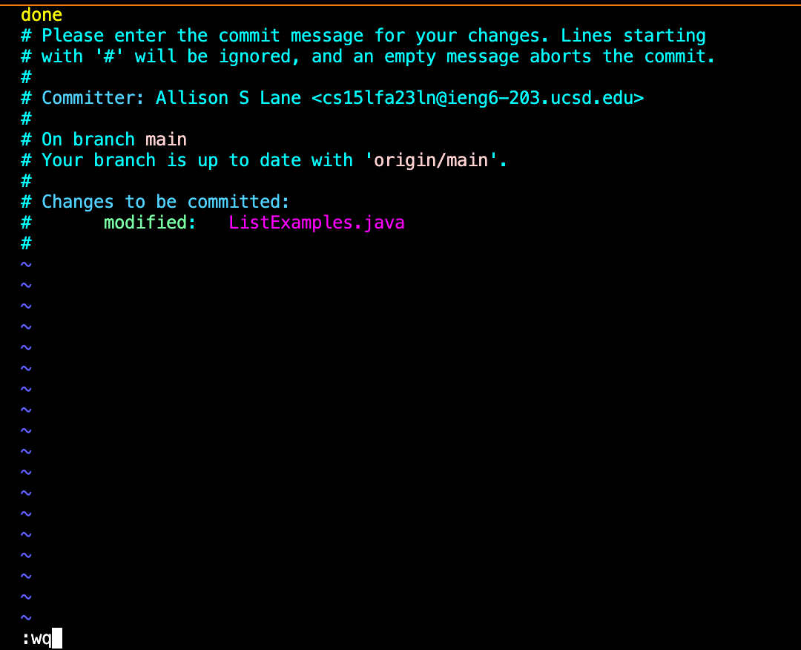
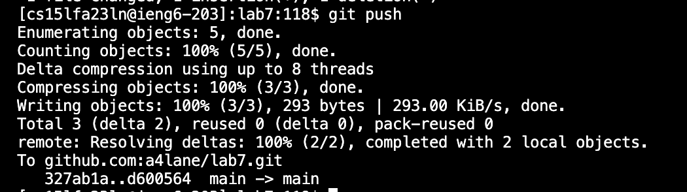

## Lab Report 4

**Log into ieng6**

Keys pressed: `<up><up><enter>` 

The ssh cs15lfa23ln@ieng6.ucsd.edu command was 2 up in my search history, so I pressed the up arror twice to access it and enter to run the command. This logged me into the ieng6 machine.

**Clone your fork of the repository from your Github account (using the SSH URL)**

Keys pressed: `'g''i''t'<space>'c''l''o''n''e'<space><ctrl-v>`

I typed out "git clone" and then pasted the ssh URL to my fork of the lab 7 repository on github. This cloned the lab 7 repository into the remote server.

**Run the tests, demonstrating that they fail**

Keys pressed: `'c''d'<space>'l'<tab><enter>`

I typed out "cd" and then l followed by tab, which autofilled the command to "lab7/". This changed my working directory to ~/lab7.

Keys pressed: `'b''a''s''h'<space>'t'<tab><enter>`

I typed out "bash" and then t followed by tab, which autofilled to test.sh. Running this command ran the bash script which compiles and runs the .java files & junit tests.

**Edit the code file to fix the failing test**
  

Keys pressed: `'v''i''m'<space>'L'<tab>'.''j''a''v''a'<enter>`

Typed out "vim", and the the first letter of the file I wanted to edit 'L' followed by tab which autocompleted it to ListExamples (the point from which there are multiple possibilities). Then completed the file name with .java. This opened up the file in vim to edit.

  

Keys pressed: `'4''4''G''e''x''i''2'<ESC><shift-;>'w''q'<enter>`

"44G" jumped the cursor to the 44th line, where the error was. "e" brought the cursor to the end of the current word, and then "x" deleted the character the cursor was on (1). "i" entered insert mode, and "2" inserts the character into the previous position. ESC enters normal mode, and then :wq saves and exits the file in vim. This successfully fixes the error in the java file and saves the new version where index1 is changed to index2.

**Run the tests, demonstrating that they now succeed**
  

Keys pressed: `<up><up><enter>`  

This command was two up in my history, so I accesed it by pressing the up arrow twice. Same as before, this ran the bash script test.sh.

**Commit and push the resulting change to your Github account (you can pick any commit message!)**

 
Keys pressed: `'g''i''t'<space>'a''d''d'<space>'L'<tab><enter>`    

I typed out "git add" and the first letter of the modified file "L", then tab autocompleted the full name of the java file. This command added the file ListExamples.java to be staged for commit.

   

Keys pressed: `<up><ctrl-w><ctrl-w>'c''o''m'<tab><enter>`  

I pressed the up arrow to access my previous command, then ctrl-w twice to delete the last 2 words. Then typed out "com", the point where "commit" is the only possible completion, and pressed tab to accomplish this. The command commits the changes of all files that have been staged, and opens a vim file that prompts for a commit message.

Keys pressed: `'i''d''o''n''e'<ESC><shift-;>'w''q'<enter>`    

  
With the cursor in the top left corner, pressing "i" enters insert mode and then I typed my commit message "done". ESC to enter normal mode, then :wq to save and exit the vim file. This adds the commit message and completes the commit.

  

Keys pressed: `<up><ctrl-w>'p''u''s''h'<enter>`
From the previous command accessed with the up arrow, I pressed ctrl-w to delete "commit" and typed out push. This exported the commit to the original repository in github, where the file ListExamples.java specifically is updated with the changes made remotely.
