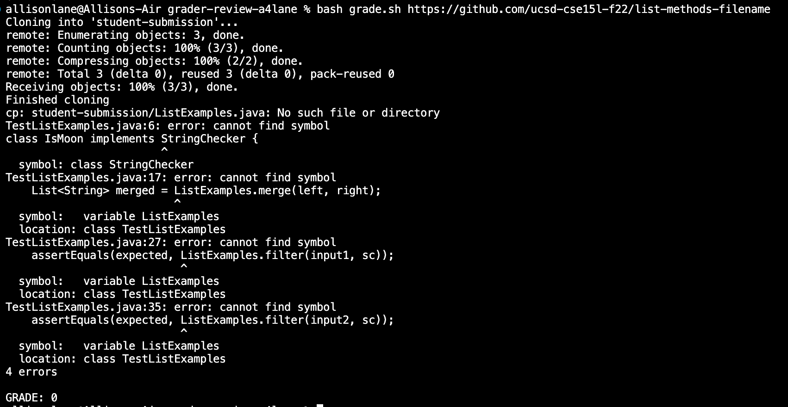
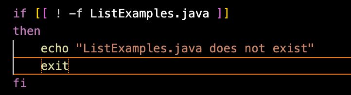
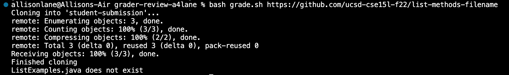

# Lab Report 5

**OP:** There's something going wrong when I try to run the grading script; its worked for every other student submission, but running it on this one causes all these errors. I'm guessing it has to do with the students' files? Here's a screenshot of the symptoms:



**TA:** It looks like a lot of these error messages have to do with the ListExamples.java file. Can you add some code to the bash script that checks if the file structure of each student submission is correct?


**OP:** Here's what I did:  
  

I added this if statement to check if the file ListExamples.java exists, and if not, print an error message and exit the script. It turns out that's what the issue was, here's the output from running the script with the same student submission:


I assumed every student submission would have correctly named files, so I didn't include any checks for this in the bash script. Because there was no ListExamples.java, the junit tests in TestListExamples couldn't run correctly because they use ListExamples objects, and that's why I got the errors.


Setup:

```
CPATH='.:lib/hamcrest-core-1.3.jar:lib/junit-4.13.2.jar'

rm -rf student-submission
rm -rf grading-area

mkdir grading-area

git clone $1 student-submission
echo 'Finished cloning'

cp student-submission/ListExamples.java TestListExamples.java grading-area
cp -r lib grading-area

cd grading-area

javac -cp .:lib/hamcrest-core-1.3.jar:lib/junit-4.13.2.jar *.java
java -cp .:lib/hamcrest-core-1.3.jar:lib/junit-4.13.2.jar org.junit.runner.JUnitCore TestListExamples > junit-results.txt 


result=$( tail -n 2 junit-results.txt )
echo " "

if [[ $result == OK* ]]
then
    echo "GRADE: 100%"
elif [[ $result == *3*1 ]]
then
    echo "GRADE: 66%"
elif [[ $result == *3*2 ]]
then
    echo "GRADE: 33%"
else 
    echo "GRADE: 0"
fi

all_results+=$result
echo $all_results >> ../final-results.txt
``` 

